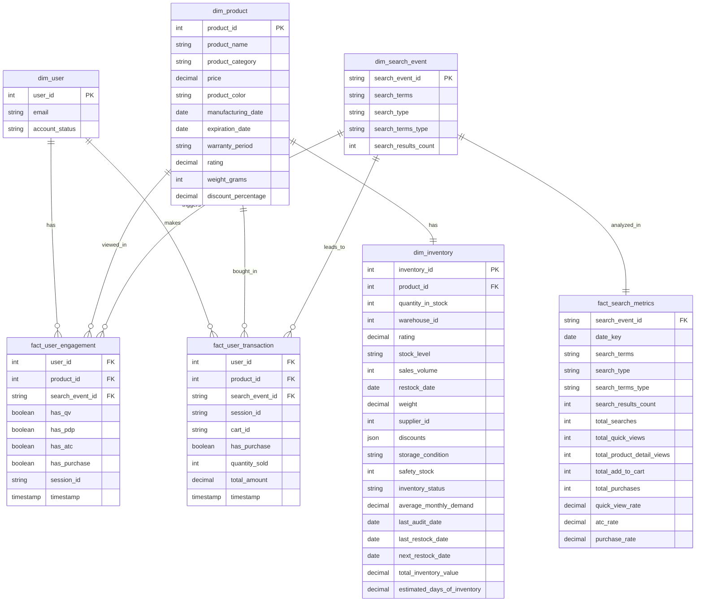

# Data Mart ERD

## Key Relationships

### Dimension Tables
1. `dim_user`: User dimension table
   - Primary Key: user_id
   - Contains basic user information

2. `dim_product`: Product dimension table
   - Primary Key: product_id
   - Contains basic product information

3. `dim_inventory`: Inventory dimension table
   - Primary Key: inventory_id
   - Foreign Key: product_id -> dim_product
   - Contains inventory and product relationship information

4. `dim_search_event`: Search event dimension table
   - Primary Key: search_event_id
   - Contains basic search event information

### Fact Tables
1. `fact_user_engagement`: User behavior fact table
   - Composite Key: [user_id, search_event_id, timestamp]
   - Foreign Keys:
     - user_id -> dim_user
     - product_id -> dim_product
     - search_event_id -> dim_search_event
   - Records user browsing, add-to-cart, and other engagement behaviors

2. `fact_user_transaction`: User transaction fact table
   - Composite Key: [user_id, search_event_id, product_id, timestamp]
   - Foreign Keys:
     - user_id -> dim_user
     - product_id -> dim_product
     - search_event_id -> dim_search_event
   - Records user purchase behaviors

3. `fact_search_metrics`: Search metrics fact table
   - Composite Key: [search_event_id, date_key]
   - Foreign Key: search_event_id -> dim_search_event
   - Records search conversion rates and other metrics
